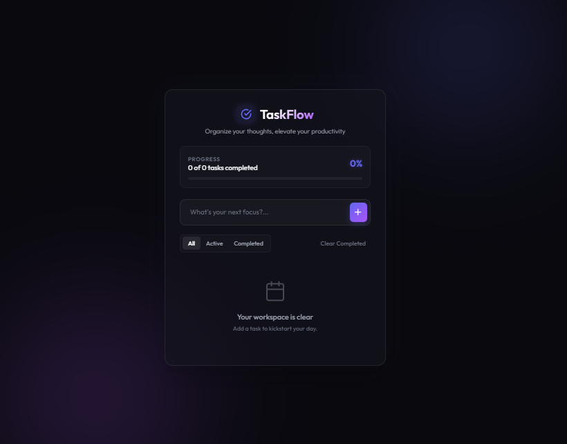

# 📝 Dynamic task management system (To-Do List Application)

Welcome to the production-ready frontend task management ecosystem built using vanilla web parameters. This project focuses on absolute real-time state management, DOM manipulation matrices, and clean UI engineering to deliver a responsive utility application.

This repository features real-time task ingestion pipelines, interactive complete/delete state updates, and clean asset layouts built entirely without heavy third-party state frameworks.

---

## 🤵 Repository Host Details

- **Author Name:** amir
- **GitHub Profile Alias:** [amirsohail100](https://github.com/amirsohail100)
- **Official Communication Endpoints:** amirsoahil10@gmail.com
- **Project Status:** Production Ready & Functional 🟢

---

## 🖥️ Application User Interface Preview

Below is the live operational layout of the web application showing the functional inputs and rendering states from my local development system:

<!-- To-Do List UI Screenshot Section -->
<div align="center">
  
  <p><i>Interactive Task Console — Dynamic State Ingestion, Complete Toggles, and Real-Time DOM Insertion</i></p>
</div>

---

## 🛠️ Core Features & Engineering Objectives

- **Dynamic DOM Modification:** Programmed explicit JavaScript structures (`document.createElement`) to build and append real-time nodes safely into the runtime view layer.
- **State Mutation & Triggers:** Implements highly responsive event listeners (`addEventListener`) to capture text input fields, evaluate null checks, and transition execution matrices.
- **Interactive Complete/Delete States:** Deploys clean tracking logic to allow single-click completion toggles and safe item filtration arrays.
- **Modern CSS Grid & Flex Mechanics:** Utilizes robust positioning configurations to center the primary layout hub while maintaining proportional alignment across target lists.

---

## 💻 Tech Stack & Architecture

- **Structural Blueprint:** HTML5 Semantic Containers
- **Visual Styling Array:** Custom Vanilla CSS3 (Box-shadow effects, interactive hover variables, form structures)
- **Logic & Execution Pipeline:** ES6+ JavaScript Core Framework (Event Loops, DOM Ingestion, Node Engineering)

---

## 🚀 How to Run the Application Locally

Follow these precise steps to deploy and explore the application smoothly on your local machine:

### 1. Clone the Target Endpoint

```bash
git clone [https://github.com/amirsohail100/your-todo-repo-name.git](https://github.com/amirsohail100/your-todo-repo-name.git)
cd your-todo-repo-name
```
